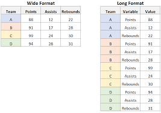

# Disclaimer: 
The content below is created as study notes based on the reading materials from Coursera for educational and illustrative purposes. 

# Module 1: Introduction to data science concepts

## Data Discourse Over the Years

### What is Data Science vs. Data Analytics?

Data Science: A field dedicated to making data more useful. Data scientists use raw data to develop new models, make predictions, and confront the unknown, often incorporating computer science, predictive analytics, statistics, and machine learning.
Data Analytics: A subfield of data science focused on creating methods to capture, process, and organize data to uncover actionable insights for solving current problems. Data analysts rely on statistics and data modeling to answer questions and recommend immediate improvements.

| Data science | Data analytics | 
|-----------------|-----------------|
| Produces broad insights that concentrate on which questions should be asked about data | Emphasizes discovering answers to questions being asked |
| Confronts what is unknown by using advanced techniques to make predictions about the future | Determines actionable insights that can be applied immediately based on existing queries |

### The Connections Between Data Science and Data Analytics

- Both fields aim to discover insights to help organizations improve and grow.
- They share common tools, software packages, and programming languages, often leading to collaborative environments where data scientists and analysts work together.
- Job responsibilities and titles in these fields often overlap due to organizational resources, budgets, and industry demands.

### The Data Professional in the Data Career Space

- Data professional refers collectively to data scientists and analysts.
- Data analytics professional highlights roles focused on analytical processes.
- Data career space includes the broad spectrum of roles and opportunities across data science and analytics.
- Job titles and responsibilities vary significantly across organizations, even for similar roles.

### The Data Career Space Over Time
The evolution of the field reflects technological and societal advancements:

| **Year**  | **Field**           | **Summary**                                                                                   |
|-----------|---------------------|-----------------------------------------------------------------------------------------------|
| **1965**  | **Technology**      | Desktop programmable calculators replaced room-sized computers.                               |
|           | **Data Storage**    | Punch cards stored programming data; magnetic tape reels held up to 3MB but required space.   |
|           | **Data Analysis**   | Shifted from manual calculations to machine-based computation.                                |
|           | **Communication**   | Electric typewriters and advanced telephones improved workplace communication.               |
| **1985**  | **Technology**      | Personal computers became common; Windows 1.0 was introduced.                                |
|           | **Data Storage**    | Floppy disks replaced punch cards; 10MB hard drives were standard.                           |
|           | **Data Analysis**   | Spreadsheets revolutionized data organization and processing.                                |
|           | **Communication**   | Early email systems were adopted in government and academia.                                 |
| **2005**  | **Technology**      | High-speed internet replaced dial-up; smart devices increased internet access.               |
|           | **Data Storage**    | Cloud services became popular; flash drives offered portable storage solutions.              |
|           | **Data Analysis**   | Predictive modeling and unstructured data analysis became critical for businesses.           |
|           | **Communication**   | Email and instant messaging became standard for collaboration.                               |
| **Today** | **Technology**      | IoT, augmented/virtual reality, and edge computing enable interactive and efficient systems.  |
|           | **Data Storage**    | Quantum computing is being developed to address complex problems.                            |
|           | **Data Analysis**   | AI accelerates innovation by combining human and machine capabilities.                       |
|           | **Communication**   | Virtual meetings, online messaging, and task management software support global collaboration.| 

### Key Takeaways
- Data science and data analytics are distinct yet interconnected disciplines, often used interchangeably in the workplace.
- The data career space has evolved alongside technology, data storage, and communication.
- Recognizing the similarities and differences between these fields will help you align your skills with relevant opportunities in the data profession.

## General data analytics principles and data types

### Data science 
A field of study that uses raw data to create new ways of modeling and understanding the unknown 

### Qualitative vs Quantitative data
Qualitative data measures qualities and characteristics; quantitative data measures numerical facts.

### Wide vs Long data
- Wide data: Subjects have data in multiple columns, with each column representing a different attribute or variable.
    - Wide data subjects can have data in multiple columns.
    - Wide data subjects can have multiple <u>columns</u> that hold the values of subject attributes. 

- Long data: Subjects have multiple rows, with each row holding the values of subject attributes, often combined with an identifier column.
    - Long data subjects can have data in multiple columns such as an identifier column and an attribute value column.
    - Long data subjects can have multiple <u>rows</u> that hold the values of subject attributes. 

*Image source: https://www.statology.org/long-vs-wide-data/*

### Structured vs Unstructured Data
| **Structured Data Examples**        | **Unstructured Data Examples**       |
|-----------------------------|-----------------------------|
| Spreadsheet          | Social media posts         |
| Relational databases         | Videos                     |
| Financial transactions logs | Images                     |
| Customer contact details     | Audio recordings           |
| Inventory records            | Emails                     |

## Data Strategy

### Stakeholders 

Individuals who have invested time and resources in a project and are interested in its outcome.

### Sample size
When collecting data for a study, what are some reasons to consider sample size?
- To collect data that represents a diverse set of perspectives
- To make sure a few unusual responses don’t skew results

### SMART methodology
The SMART methodology can be used to ask a question that promotes change. The type of SMART question that leads to change is **Action-oriented**.

### Correlation
When two variables rise and fall at the same time, they are likely correlated. Correlation indicates a relationship where changes in one variable are associated with changes in another, but it does not necessarily imply causation.

### Labels over Legend in Data Visualiztion
- Labels provide context by placing explanations close to the relevant data points.
- Labels reduce the need to look back and forth between the legend and the data, making the visualization easier to interpret.
- Labels make the data visualization more accessible because they don’t rely on the ability to interpret color.

### Key characteristics of a metric
- Metrics are used for measurement.
- Metrics are quantifiable.
- Metrics can be used to evaluate performance.

## Data integrity and data cleaning

### Bias
Interpretation bias is the tendency to interpret ambiguous situations in a positive or negative way, often based on an individual's subjective perspective or preconceived notions.

### Consent in data collection
Consent is where an individual acknowledges understanding how their data will be used and agrees to participate under those terms. Consent is a critical part of ethical data collection practices.

## Programming Languages

There are three main benefits of using a programming language to work with data: 
- Easily reproduce and share work, 
- save time, and 
- clarify the steps of analysis.

## Data visualization

Use of filters in data visualization tools
- Highlighting individual data points
- Providing data to different users based on their particular needs
- Limiting the number of rows or columns in view

# Glossary terms

Terms and definitions from Course 1, Module 1
- **Data professional**: Any individual who works with data and/or has data skills

- **Data science**: The discipline of making data useful

- **Data stewardship**: The practices of an organization that ensure that data is accessible, usable, and safe

- **Edge computing**: A way of distributing computational tasks over a bunch of nearby processors (i.e., computers) that is good for speed and resiliency and does not depend on a single source of computational power

- **Jupyter Notebook**: An open-source web application used to create and share documents that contain live code, equations, visualizations, and narrative text

- **Machine learning**: The use and development of algorithms and statistical models to teach computer systems to analyze patterns in data

- **Metrics**: Methods and criteria used to evaluate data

- **Python**: A general-purpose programming language