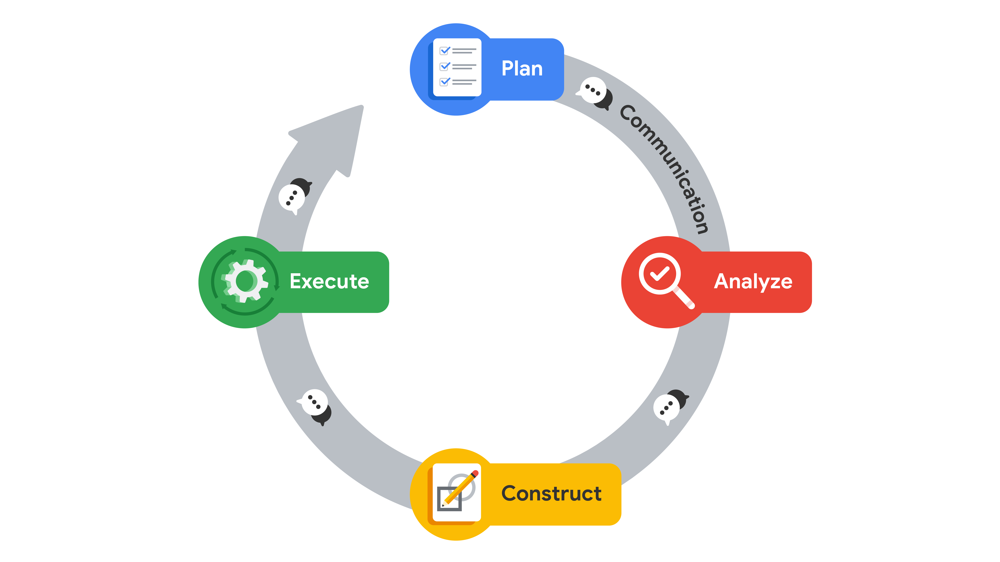

# Disclaimer: 
The content below is created as study notes based on the reading materials from Coursera for educational and illustrative purposes. 

### **What is PACE?**
- PACE is an acronym for **Plan, Analyze, Construct, Execute**.
- It provides a structured workflow for **data analysis projects**.
- Designed to be **flexible**, enabling movement between stages without interrupting the workflow.

---

### **Why Use Workflow Structures?**
- Guides professionals through project **tasks** in a logical order.
- Helps identify **complexities** and blockers early.
- Promotes **efficiency** and **productive communication**.
- Ensures resources are planned and prepared in advance.

---

### **PACE Stages Overview**

#### **Plan**
- Purpose: Define the project **scope** and establish a **foundation for success**.
- Tasks:
  - Research business data.
  - Define the project scope.
  - Develop a workflow.
  - Assess project and/or stakeholder needs.
- Summary: Conceptualize the project scope and create a roadmap to guide the process.

---

#### **Analyze**
- Purpose: Interact with data, **collect, prepare, and analyze** it.
- Tasks:
  - Acquire data from primary, secondary, governmental, or open sources.
  - Conduct **exploratory data analysis (EDA)**.
  - Clean, scrub, and format data into usable forms.
- Summary: Gather, organize, and analyze data to prepare it for modeling.

---

#### **Construct**
- Purpose: Build models to uncover **hidden relationships** within the data.
- Tasks:
  - Select modeling approach.
  - Build models and machine learning algorithms.
  - Revise and interpret models.
- Summary: Develop tools that enable informed decision-making through insights.

---

#### **Execute**
- Purpose: Share findings, receive **feedback**, and make revisions.
- Tasks:
  - Present findings to internal and external stakeholders.
  - Address feedback.
  - Incorporate recommendations.
- Summary: Deliver results and refine outputs based on stakeholder input.

---

### **Communication in PACE**
- Acts as the **electricity** in a circuit, connecting all stages.
- Improves workflow by:
  - Asking questions.
  - Gathering additional sources.
  - Updating stakeholders.
  - Presenting findings and receiving feedback.

---

### **Adaptability of PACE**
- PACE allows professionals to:
  - Move freely between stages based on project needs.
  - Revisit earlier stages as new information emerges.
  - Tailor the framework to fit any project.
- Example: Return to **Analyze** to clarify data and proceed to **Execute** to present results.

---

### **Key Takeaways**
1. PACE is a structured workflow designed for **data professionals**.
2. It enhances task management, communication, and flexibility.
3. **Adaptable** to dynamic projects and promotes a high degree of **professional flexibility**.