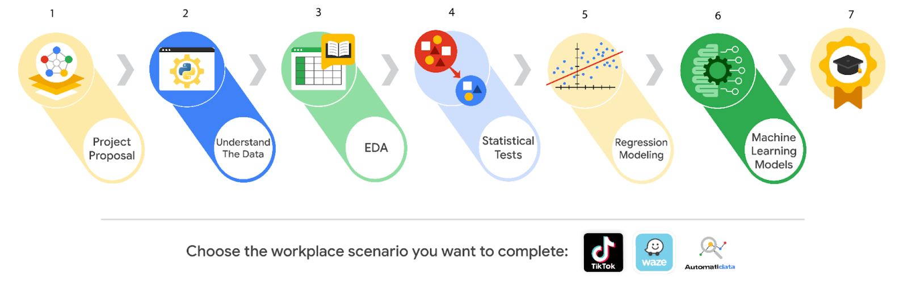

# Disclaimer: 
The content below is created as study notes based on the reading materials from Coursera for educational and illustrative purposes.

# Project Introudction

## Overview
Each course in the **Google Advanced Data Analytics Certificate** concludes with an **end-of-course portfolio project**. These projects provide hands-on opportunities to practice your skills and simulate the **full lifecycle of a data project**, reflecting real-world tasks that data professionals encounter. After completing the program, you are encouraged to compile these projects into a portfolio showcasing your data analytics skills.

---

## Importance of Communication in Data Analytics
Effective communication is crucial in data analytics for tasks such as:
- **Asking questions** to clarify objectives.
- **Sharing project needs** with team members.
- **Engaging with stakeholders** to provide updates and insights.
- **Giving and receiving feedback** to improve workflows.
- **Maintaining contact** with cross-functional team members.

Each project emphasizes **communication skills** to help you effectively manage workflows, conduct analysis, visualize data, build models, and collaborate with teams.

---

## Expectations for End-of-Course Projects
- **Workplace Scenarios:**  
  Each project is based on a workplace scenario, guiding you through tasks aligned with the course concepts and skills. These scenarios extend across all courses in the certificate program.

- **Tools and Resources:**  
  You will receive all the tools, resources, and instructions needed to complete each project. Helpful links are provided to review relevant information if needed.

- **PACE Strategy Document:**  
  Each project includes a **PACE (Plan, Analyze, Construct, Execute) strategy document** to guide your workflow. Answering its questions will:
  - Enhance your understanding of the data analysis process.
  - Document your growth as a data professional.
  - Prepare the insights and reflections needed to complete the project.

---

## How to Start Your Project
1. **Gather Information:**  
   Understand the business problem or question to be answered.

2. **Use the PACE Strategy Document:**  
   Respond to key questions that guide your workflow and deepen your insights.

3. **Create a Project Proposal:**  
   Develop a proposal to communicate your objectives with cross-functional team members.

---

# Course 1 Workplace Scenarios

## Overview
The **Google Advanced Data Analytics Certificate** provides a choice of **three workplace scenarios** for completing end-of-course projects:
- **Automatidata**: A fictional data consulting firm.
- **TikTok**: In partnership with the short-form video platform.
- **Waze**: In partnership with the real-time driving directions app.

Each scenario offers opportunities to apply skills and create work samples for your portfolio. It’s recommended to follow the **same scenario** across all courses for a cohesive experience. However, you may explore multiple scenarios for additional practice.

---

## Course 1 Workplace Scenarios

### **1. Automatidata**
- **Project Goal**:  
  Develop an app for the NYC Taxi & Limousine Commission (TLC) to estimate taxi fares in advance.  
- **Scenario**:  
  As a newly hired data professional at Automatidata, you will structure tasks into a project proposal for TLC’s fare estimation app.  
- **Tasks**:  
  - Gather information from the last executive meeting notes.  
  - Assign **PACE stages** to tasks.  
  - Organize tasks into milestones.  
  - Create a project proposal for the executive team.

---

### **2. TikTok**
- **Project Goal**:  
  Create a machine learning model to classify claims in user-submitted videos.  
- **Scenario**:  
  As a TikTok data analyst, develop a project proposal for the claims classification project based on leadership team requirements.  
- **Tasks**:  
  - Gather information from stakeholder notes.  
  - Assign **PACE stages** to tasks.  
  - Organize tasks into milestones.  
  - Create a project proposal for the TikTok data team.

---

### **3. Waze**
- **Project Goal**:  
  Build a machine learning model to predict and prevent **monthly user churn**.  
- **Scenario**:  
  As a new member of Waze’s data team, create a project proposal to define the goal, tasks, milestones, and stakeholders for the churn project.  
- **Tasks**:  
  - Assign **PACE stages** to tasks.  
  - Organize tasks into milestones.  
  - Create a project proposal for the Waze data team.