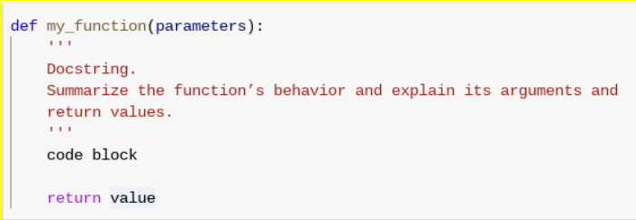

# Reference guide: Functions

As you’ve been learning, functions are bodies of reusable code for performing specific processes or tasks. They help you do more work with less code. Function examples include: 

A specific calculation or measurement, such as converting Fahrenheit to Celsius
An inventory utility to iterate quantities and calculate the total cost of goods in stock
Building a DataFrame from a series or dictionary data
An application utility such as a spell checker

In this reading, you will learn how to define, build, and call functions. 

# Function syntax
Define functions using the following syntax and format:



1. Begin with the def keyword followed by the function’s name, then put its parameters/arguments in parentheses, ending with a colon.
    * Python convention is to use snake_case (lowercase words separated by underscores) for function names.
2. For important functions or functions whose purposes or operations are not very obvious, include a docstring. Write the docstring between three opening and closing quotation marks. 
    * The docstring should be in the form of a command (e.g., “Add two numbers” as opposed to “Adds two numbers”).
    * The docstring should summarize the function’s behavior and explain its arguments and return values.
    * The docstring should be indented four spaces from the definition statement.
3. Write the body of the function. 
    * All code should be indented at least four spaces from the definition statement, but there can be many levels of indentation depending on the complexity of the code. 
4. Finally, use a return statement to return a value or a print statement to print something to the console and complete the function. This line should also be indented four spaces.

# return vs. print
Sometimes the difference between return statements and print statements isn’t clear to new learners of Python. It’s important to understand what each action is and when to use it. Return statements give you a result that you can use for something else. It doesn’t have to be something that prints when the function is run. Print statements print something to the console and nothing more. Think of it like this: a return statement is like your brother going to the market and bringing you back a bag of potatoes. A print statement is like your brother going to the market, coming home, and telling you what kind of potatoes were for sale. With the return statement, you have some potatoes to cook. With the print statement, you just know what potatoes are available, but you don’t have any potatoes.

# Functions vs. methods
Functions and methods are very similar, but there are a few key differences. Methods are a specific type of function. They are functions that belong to a class. This means that you can use them—or “call” them—by using dot notation. 

Method example: 
```
my_string = “The eagles filled the sky.”
my_string.split()
```

The split method is a function that belongs to the string class. It splits strings on their whitespaces. 

Standalone functions do not belong to a particular class and can often be used on multiple classes. 

Function example:
```
>>> sum([6, 3])
9
```

You can review Python’s list of built-in functions and research how other people use them in the Jupyter forum, StackOverflow, and other online communities. 

# Resources for more information
For more information on functions, consider the Python Reference Library, Data types, Functions, Symbols

Built-in functions: 
* enumerate()
* isinstance()
* dict()
* type() 
* len()
* set()
* zip()

Docstring conventions: PEP 257 guide to writing docstrings